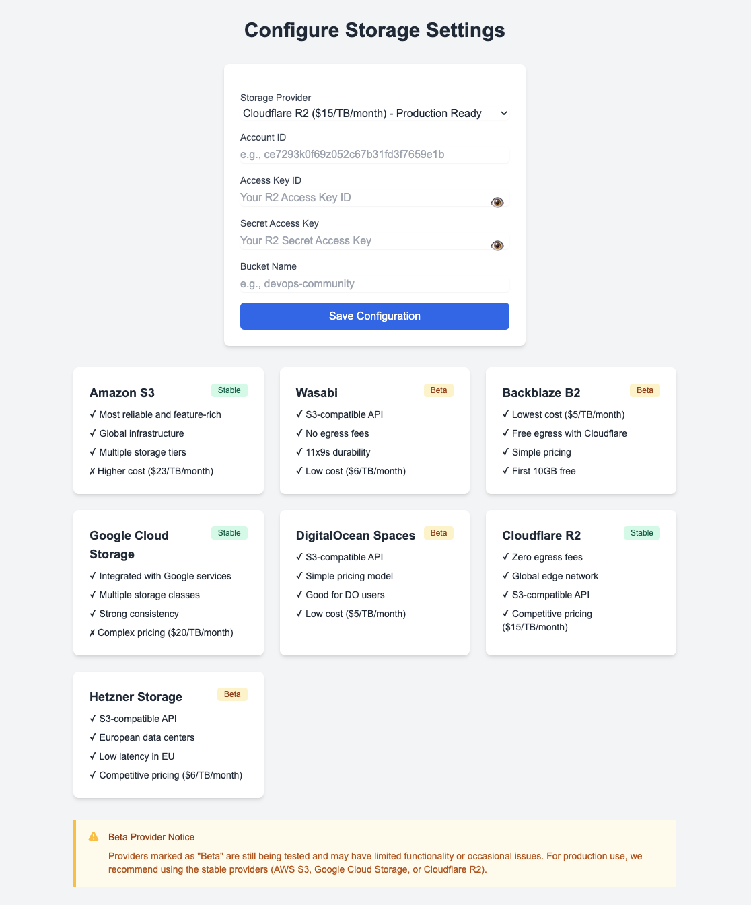

# Cloud Storage Manager

A modern web application for managing files across multiple cloud storage providers with a clean and intuitive interface.


## Features

- 📁 Intuitive file and folder management
- 🔄 Drag-and-drop file uploads
- 🔗 Secure file sharing with temporary URLs
- 📱 Responsive design for mobile and desktop
- 🎯 Real-time upload progress tracking
- 🗂️ Folder creation and hierarchical navigation
- 🔍 File search and filtering
- 🔒 Secure file handling with AWS S3

## Supported Cloud Providers


The Cloud Storage Manager supports multiple cloud storage providers, giving you the flexibility to choose the best solution for your needs. Whether you prioritize cost, performance, or specific features, you can seamlessly switch between providers while maintaining a consistent user experience.

### Enterprise-Grade Solutions
- **Amazon S3** ($23/TB/month)
  - Most reliable and feature-rich
  - Multiple storage tiers
  - Advanced analytics and automation
  - Global infrastructure

- **Google Cloud Storage** ($20/TB/month)
  - Integrated with Google services
  - Multiple storage classes
  - Strong consistency
  - 5GB free tier

### Cost-Effective Solutions
- **Cloudflare R2** ($15/TB/month)
  - Zero egress fees
  - Global edge network
  - S3-compatible API
  - 10GB free tier

- **Wasabi** ($6.99/TB/month)
  - No egress fees
  - S3-compatible API
  - 11x9s durability
  - Simple pricing

- **Backblaze B2** ($6/TB/month)
  - Lowest cost
  - Free egress with Cloudflare
  - Simple pricing
  - First 10GB free

- **DigitalOcean Spaces** ($5/TB/month)
  - Simple pricing structure
  - Built-in CDN integration
  - S3-compatible API
  - 250GB included bandwidth

- **Hetzner Storage** ($4/TB/month)
  - European data centers
  - S3-compatible API
  - Automated snapshots
  - Predictable pricing

## Getting Started

### Prerequisites

- Python 3.10 or higher
- AWS Account with S3 access
- Poetry for dependency management

### Installation

1. Clone the repository: 
```bash
git clone https://github.com/rohitg00/s3-file-share-for-free.git
cd s3-file-share-for-free
```
2. Running Application using poetry:
- Install dependencies:
```bash
poetry install
```
- Start the application:
```bash
poetry run python app.py
```
3. Running Application using PIP:
- Install dependencies:
```bash
pip install -r requirements.txt
```
- Start the application:
```bash
python app.py
```

4. Open your browser and navigate to `http://localhost:5001` to access the application.


## Configuration
1. Click "Configure Storage" button
2. Select your preferred storage provider
3. Enter provider-specific credentials:
   - For AWS S3: Access Key ID, Secret Key, Region
   - For Google Cloud: Project ID, Service Account JSON
   - For Cloudflare R2: Account ID, Access Key, Secret Key
   - For other providers: Follow provider-specific instructions

## Usage

### File Upload
- Drag and drop files into the upload area
- Click "Upload" button to select files manually
- Monitor upload progress in real-time

### File Management
- Create folders using the "New Folder" button
- Navigate through folders by clicking
- Delete files/folders using the delete icon
- Download files directly from the interface

### File Sharing
- Generate shareable links with custom expiration
- Copy links to clipboard with one click
- Set access permissions for shared files

## Architecture

The application uses:
- Flask for the backend server
- AWS S3 for file storage
- Modern JavaScript for frontend interactivity
- Bootstrap for responsive design

## Technical Details

- Backend: Python Flask
- Frontend: JavaScript, Tailwind CSS
- Storage: Amazon S3
- File Upload: Chunked upload for large files
- Preview Support: Images, PDFs, Videos
- Security: Server-side AWS credential management

## Security Features

- Secure file handling
- AWS IAM best practices
- Input validation and sanitization
- Temporary URL generation
- Access control implementation

## Deployment on Sevalla

### Prerequisites
- A Sevalla account (Sign up at [sevalla.com](https://sevalla.com))
- Your application code pushed to a Git repository
- AWS credentials (Access Key ID and Secret Access Key)

### Deployment Steps

1. **Login to Sevalla Dashboard**
   - Go to [dashboard.sevalla.com](https://dashboard.sevalla.com)
   - Sign in with your credentials

2. **Create New Application**
   - Click on "New Application" 
   - Select your Git repository
   - Choose the branch you want to deploy
   - ✅ Automatic Deployments when commits are pushed to the repository


3. **Configure Environment Variables**
   Add the following environment variables:
   ```env
   AWS_ACCESS_KEY_ID=your_access_key_id
   AWS_SECRET_ACCESS_KEY=your_secret_access_key
   AWS_REGION=your_aws_region
   ```


4. **Deploy Application**
   - Click "Deploy" to start the deployment process
   - Sevalla will automatically:
     - Install dependencies from requirements.txt
     - Use nix to install dependencies and create docker image
     - Set up the Python environment
     - Start your Flask application


5. **Access Your Application**
   - Once deployed, Sevalla will provide you with a URL
   - Your application will be accessible at `https://your-app-name.sevalla.app`

### Monitoring and Logs

- Access application logs from the Sevalla dashboard
- Monitor application performance metrics
- Set up alerts for application status

For more detailed deployment instructions, visit [Sevalla Documentation](https://docs.sevalla.com)


## Contributing

1. Fork the repository
2. Create your feature branch (`git checkout -b feature/AmazingFeature`)
3. Commit your changes (`git commit -m 'Add some AmazingFeature'`)
4. Push to the branch (`git push origin feature/AmazingFeature`)
5. Open a Pull Request

## License

This project is licensed under the MIT License - see the [LICENSE](LICENSE) file for details.

## Acknowledgments

- AWS SDK for Python (Boto3)
- Flask web framework
- Bootstrap CSS framework
- Neon cloud icon design for favicon

## Support

For support, please open an issue in the GitHub repository or contact [email here](ghumare64@gmail.com)

---

Made with ❤️ by Rohit Ghumare